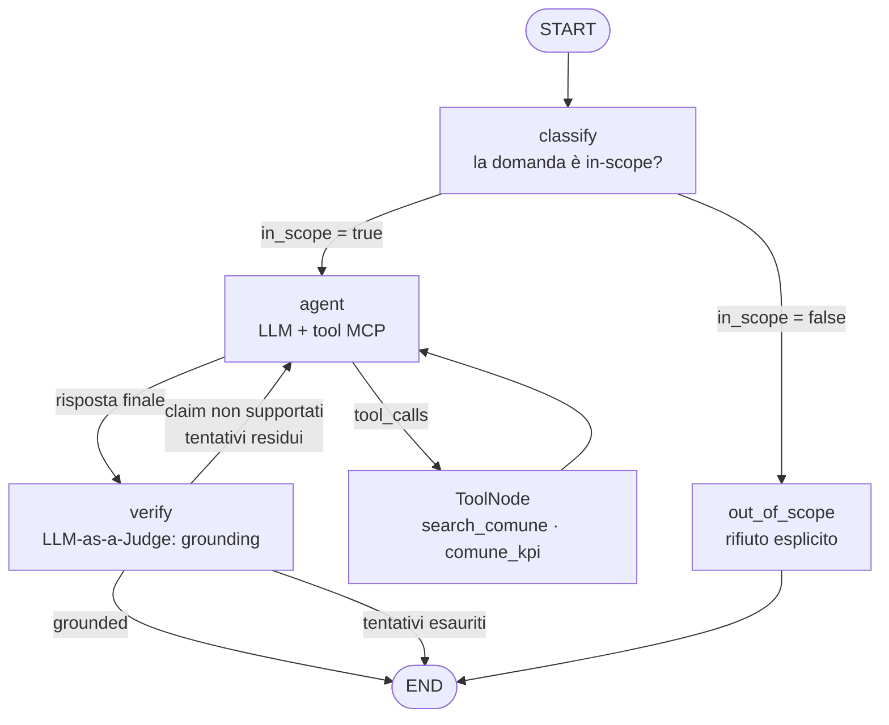

# Cruscotto Agent

Un agente conversazionale che permette a chiunque di ottenere, in linguaggio naturale, le informazioni pubbliche sul proprio comune (popolazione, redditi, scuole, opere pubbliche, raccolta differenziata, fondi PNRR) interrogando **esclusivamente** i dati ufficiali (ISTAT, MEF, ANAC, BDAP-MOP, SIOPE, MIUR, ISPRA) esposti dal server MCP [Cruscotto Italia](https://cruscotto-italia-mcp.agid.workers.dev/mcp) di AgID.

## L'obiettivo

Questi dati sono già pubblici, ma pubblico non significa accessibile. Per rispondere a una domanda semplice come *"Quanto si guadagna in media nel mio comune, rispetto a quello accanto?"* servono oggi la conoscenza di quale portale consultare, il codice ISTAT del comune, la capacità di leggere dataset eterogenei e di confrontarli a mano.

L'obiettivo del progetto è togliere di mezzo quei passaggi: **una domanda, una risposta fondata sui dati ufficiali**, senza che l'utente debba sapere quale fonte contiene cosa. Il destinatario non è l'analista che sa già dove guardare, ma il cittadino, l'amministratore locale o il giornalista che ha una domanda e non un metodo per rispondersi.

## Il problema incontrato: l'affidabilità

Un'interfaccia del genere ha però senso solo se ci si può fidare di ciò che risponde, e qui è dove il progetto ha richiesto il lavoro maggiore. Proprio l'utente che ha più bisogno di questo strumento è quello che **non ha modo di accorgersi se un numero è sbagliato**: se sapesse verificarlo, non gli servirebbe lo strumento.

Su domande comparative ("Confronta il reddito medio tra 7 comuni pugliesi") un agente ReAct standard tende infatti a:

- **fabbricare comuni** non presenti nei dati recuperati, per completare la tabella richiesta;
- **alterare valori** reali in cifre plausibili;
- **inventare derivati** (ranking, trend, rapporti) non calcolabili dai dati grezzi effettivamente ottenuti.

Sono errori che a occhio non si vedono: la risposta è stilisticamente coerente e i numeri sono verosimili. Un dato sbagliato su finanza pubblica o redditi, presentato con la stessa sicurezza di uno corretto, è peggio di nessuna risposta perché eredita la credibilità della fonte ufficiale senza esserne coperto.

La parte tecnicamente più impegnativa è stata quindi rendere quel rischio **misurabile e riducibile**, non eliminarlo a parole: un **ciclo di auto-correzione basato su grounding verification** e una **suite di valutazione avversariale** che quantifica quanto quel ciclo funzioni davvero. È il percorso documentato nel resto di questo README.

---

## Architettura

Grafo [LangGraph](https://github.com/langchain-ai/langgraph) a stato esplicito, con tre sottosistemi: routing di scope, loop ReAct sui tool MCP, verifica di grounding con retry.



Lo stato (`AgentState`) estende `MessagesState` con tre campi che rendono il controllo di flusso ispezionabile e testabile dall'esterno: `in_scope`, `grounded`, `grounding_attempts`.

---

## Scelte tecniche da evidenziare

**1. Verifica di grounding come nodo del grafo, non come prompt instruction.**
Il nodo `verify` estrae i dati grezzi da *tutti* i `ToolMessage` della conversazione e li passa a un giudice LLM con output strutturato (`GroundingVerdict`: `grounded: bool`, `unsupported_claims: list[str]`). La verifica avviene contro il payload MCP effettivo, non contro la memoria del modello. Chiedere al modello "non inventare dati" nel system prompt non è una garanzia verificabile; un nodo che confronta risposta e payload lo è.

**2. La correzione rientra nel loop ReAct, non è una semplice riscrittura.**
Il feedback del giudice viene reiniettato come `HumanMessage` nella conversazione. Questo è deliberato: l'agente può quindi **chiamare nuovi tool** per recuperare i dati mancanti, invece di limitarsi a riformulare il testo esistente. È la differenza tra "rimuovi il claim non supportato" e "vai a prendere il dato che ti serve".

**3. Degradazione trasparente invece di loop infinito.**
`MAX_GROUNDING_ATTEMPTS = 2`. Esaurito il budget, l'agente non fallisce in silenzio e non ritenta all'infinito: allega alla risposta l'elenco esplicito dei claim non verificabili. L'incertezza diventa parte dell'output.

**4. Classificatore di scope con l'intera history.**
Il nodo `classify` riceve tutta la conversazione, non solo l'ultimo turno, perché lo scope di un follow-up ("e Genova?") è determinabile solo dal contesto. Blocca le richieste fuori dominio prima di spendere chiamate ai tool.

**5. Whitelist dei tool MCP.**
Il server espone sei tool; l'MVP ne abilita due (`search_comune`, `comune_kpi`) tramite `ALLOWED_TOOLS`. Scelta di budget di contesto e di determinismo: `comune_kpi` costa ~620 token per comune, mentre `comune_dashboard` restituisce payload di centinaia di KB che saturerebbero la finestra su una query comparativa a 7 comuni.

**6. Un unico modello economico per tutti i ruoli.**
Answering, judge e classifier usano lo stesso modello flash-lite con `with_structured_output()`. La qualità del sistema deriva dalla topologia del grafo e dalla verifica, non dalla taglia del modello - ipotesi verificata dalla suite di eval.

**7. Async end-to-end e stato persistito.**
Tutti i nodi sono `async`; la persistenza via `InMemorySaver` con `thread_id` rende le conversazioni multi-turno riproducibili e isola le run di eval una dall'altra.

---

## Metodologia di valutazione

Il progetto include **due harness distinti**, che misurano due cose diverse: la precisione del giudice e l'efficacia del ciclo di correzione.

### A. Precisione del giudice, su dataset avversariale annotato

Pipeline in tre passi (`eval/collect_seeds.py` -> `eval/inject.py` -> `eval/run_judge_eval.py`):

1. **Raccolta seed**: 8 domande vengono eseguite sul grafo reale; si conservano solo le risposte già grounded al primo tentativo, con i rispettivi payload MCP. Il ground truth è materiale reale, non sintetico.
2. **Iniezione controllata**: per ogni seed un modello genera 4 varianti: tre archetipi di allucinazione (`fabricated_comune`, `wrong_value`, `fabricated_derived`) e una **parafrasi pulita di controllo**, che riformula senza alterare alcun claim. Ogni variante alterata conserva le frasi iniettate *verbatim* nel campo `injected_claims`. Totale: **32 casi annotati**.
3. **Misura**: il giudice viene eseguito su tutti i casi e ogni verdetto classificato in TP / FP / FN / TN.

Due dettagli metodologici che contano:

- **La variante `clean` è un controllo negativo, non riempimento.** Senza di essa si misurerebbe solo il recall, e un giudice che flagga *tutto* sembrerebbe perfetto. Il dataset misura **detection rate e false positive rate insieme**.
- **Il dataset `_hard` neutralizza gli artefatti stilistici.** Nella prima iterazione i claim iniettati erano riconoscibili dalla forma - frasi autonome introdotte da "Inoltre…" - quindi il giudice poteva individuarli senza guardare i dati. Il prompt dell'injector è stato riscritto per **fondere** il claim nella struttura esistente (riga in più nella stessa tabella, proposizione incidentale in una frase già presente), vietando i connettivi rivelatori. La versione `hard` verifica che il giudice stia davvero confrontando risposta e payload.

### B. Riduzione delle allucinazioni end-to-end

`eval/run_hallucination_reduction.py` esegue **16 prompt avversariali** costruiti per indurre fabbricazione: ranking nazionali, tabelle a 7 comuni, richieste di peer group "comparabili" (dove il modello deve scegliere i comuni da sé), incarichi ad alta pressione come "certifica la solidità finanziaria di Napoli confrontandola con Bari, Catania e Verona". Per ogni caso si registra se la risposta era grounded **al primo tentativo** e se lo è **dopo l'auto-correzione**: la differenza tra i due valori è l'effetto misurato del ciclo.

### Risultati

Entrambi gli script stampano la metrica aggregata in chiusura.

| Harness | Metrica | Valore |
| --- | --- | --- |
| `run_judge_eval.py`: dataset `_hard` | detection rate dei claim non supportati iniettati | **100%** (24/24) |
| `run_judge_eval.py`: dataset `_hard` | false positive rate sui controlli puliti | **0%** (0/8) |
| `run_hallucination_reduction.py`: 16 prompt | risposte allucinate: primo tentativo -> dopo auto-correzione | **19% -> 0%** (3/16 -> 0/16) |

Il giudice separa correttamente tutte e tre le categorie di iniezione dai controlli puliti, inclusa `wrong_value`, che è la più insidiosa, perché altera una singola cifra all'interno di una frase per il resto corretta.

Sul risultato va detto con chiarezza cosa **non** significa: 32 casi derivati da 8 seed sono un campione piccolo, e su 8 soli controlli puliti l'intervallo di confidenza del false positive rate resta ampio. Il valore del numero sta nel fatto che è stato ottenuto **dopo** aver irrobustito il dataset: sulla prima iterazione un punteggio alto sarebbe stato in parte dovuto agli artefatti stilistici descritti sopra, non alla verifica sui dati.

Nell'harness end-to-end i 3 casi intercettati al primo tentativo sono istruttivi, perché mostrano che il giudice non lavora solo sui numeri:

- **confusione tra colonne**: l'agente aveva riportato il numero di strutture ricettive di Trieste al posto dei posti letto: un errore fattuale reale, non un'invenzione;
- **interpretazione non supportata**: affermazioni come "la concentrazione di valore storico per metro quadro è tra le più alte al mondo" o giudizi sull'impatto del turismo, non derivabili da un conteggio di strutture e letti;
- **causalità inventata**: la spiegazione dei divari di reddito con la diversa natura dei tessuti economici locali, plausibile ma assente dai dati recuperati.

Tutti e tre sono stati corretti al secondo tentativo, rientrando nel budget di `MAX_GROUNDING_ATTEMPTS`. La categoria più frequente non è il numero sbagliato ma il **commento che eccede i dati**: è il tipo di affermazione che un lettore non esperto accetterebbe senza esitazione, ed è esattamente ciò che questo sistema deve intercettare.

---

## Struttura del repository

```
src/cruscotto_agent/
├── graph.py         # composizione del grafo: nodi, archi condizionali, compile
├── nodes.py         # classify · verify · out_of_scope · call_model + funzioni di routing
├── schemas.py       # AgentState, IntentClassification, GroundingVerdict (Pydantic)
├── models.py        # factory dei modelli, structured output per judge e classifier
├── mcp_setup.py     # client MCP streamable-http + whitelist dei tool
└── eval/
    ├── collect_seeds.py               # step 1 — seed reali già grounded
    ├── inject.py                      # step 2 — generazione varianti avversariali
    ├── run_judge_eval.py              # step 3 — TP/FP/FN/TN del giudice
    ├── run_hallucination_reduction.py # end-to-end: effetto del ciclo di correzione
    └── schemas.py                     # InjectionCase, InjectionType
eval_data/
├── seeds.json                   # 8 seed grounded con i relativi payload MCP
├── injection_cases.json         # 32 casi, prima iterazione
└── injection_cases_hard.json    # 32 casi, claim fusi stilisticamente
main.py              # entry point: run su un prompt di esempio
```

---

## Setup

Requisiti: Python 3.12+, [uv](https://docs.astral.sh/uv/), una API key Google AI Studio.

```bash
uv sync
echo "GOOGLE_API_KEY=la-tua-chiave" > .env
```

Il server MCP è pubblico e non richiede autenticazione (rate limit: 60 richieste/minuto per IP).

## Esecuzione

```bash
# run singola sul prompt di esempio in main.py
uv run python main.py

# suite di valutazione (dalla root del repo: i path dei dataset sono relativi)
# senza argomenti usa il dataset di riferimento, injection_cases_hard.json
uv run python -m cruscotto_agent.eval.run_judge_eval
uv run python -m cruscotto_agent.eval.run_judge_eval eval_data/injection_cases.json
uv run python -m cruscotto_agent.eval.run_hallucination_reduction

# rigenerare il dataset avversariale da zero
uv run python -m cruscotto_agent.eval.collect_seeds
uv run python -m cruscotto_agent.eval.inject
```

---

## Limiti noti e sviluppi

- **Il giudice è lo stesso modello che risponde.** Riduce i costi e rende il sistema autocontenuto, ma introduce correlazione degli errori: un cross-check con un modello di famiglia diversa è il passo successivo naturale.
- **Grounding ≠ completezza.** La verifica intercetta le affermazioni non supportate, non le omissioni: una risposta corretta ma parziale passa come grounded.
- **Due tool su sei.** `comune_dashboard` e le query censuarie sub-comunali sbloccherebbero analisi molto più profonde, ma richiedono una strategia di compattazione del contesto prima di poter entrare nel loop.
- **Nessun test unitario sui nodi.** La validazione oggi è interamente comportamentale, attraverso le due suite di eval.
