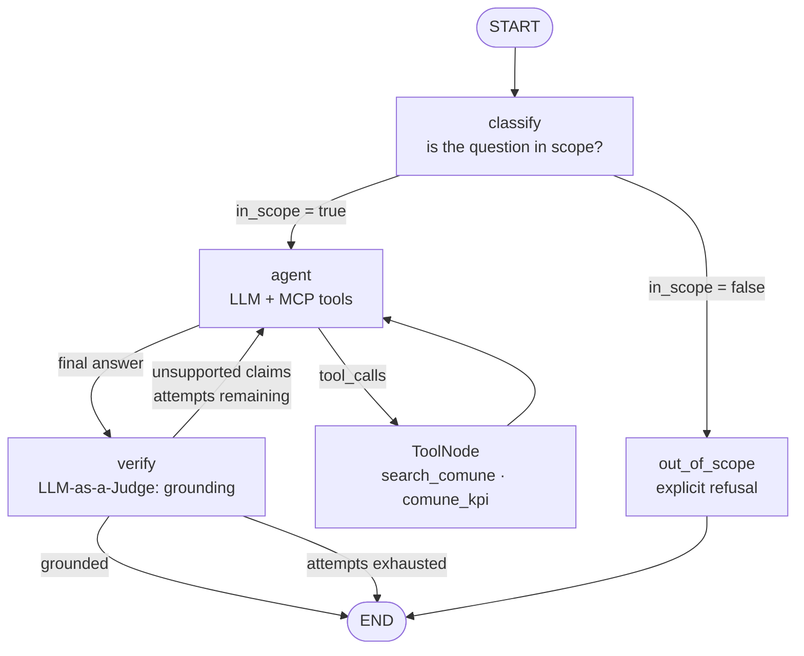

# Cruscotto Agent

A conversational agent that lets anyone obtain, in natural language, public information about their own municipality (population, income, schools, public works, waste recycling, PNRR funds) by querying **exclusively** the official data (ISTAT, MEF, ANAC, BDAP-MOP, SIOPE, MIUR, ISPRA) exposed by AgID's [Cruscotto Italia](https://cruscotto-italia-mcp.agid.workers.dev/mcp) MCP server.

## The goal

This data is already public, but public does not mean accessible. Answering a simple question such as *"What is the average income in my municipality, compared to the one next door?"* currently requires knowing which portal to consult, the municipality's ISTAT code, and the ability to read heterogeneous datasets and compare them by hand.

The goal of the project is to remove those steps: **one question, one answer grounded in official data**, without the user having to know which source contains what. The intended user is not the analyst who already knows where to look, but the citizen, the local administrator or the journalist who has a question and no method to answer it.

## The problem encountered: reliability

An interface like this, however, only makes sense if you can trust what it answers, and this is where the project required the most work. The very user who needs this tool the most is the one who **has no way of noticing when a number is wrong**: if they could verify it, they would not need the tool.

On comparative questions ("Compare the average income across 7 municipalities in Puglia") a standard ReAct agent tends to:

- **fabricate municipalities** not present in the retrieved data, in order to complete the requested table;
- **alter real values** into plausible figures;
- **invent derived facts** (rankings, trends, ratios) that cannot be computed from the raw data actually obtained.

These are errors you cannot spot by eye: the answer is stylistically coherent and the numbers are believable. A wrong figure about public finance or income, presented with the same confidence as a correct one, is worse than no answer at all, because it inherits the credibility of the official source without being backed by it.

The technically most demanding part was therefore making that risk **measurable and reducible**, rather than ruling it out in words: a **self-correction loop based on grounding verification** and an **adversarial evaluation suite** that quantifies how well that loop actually works. That is the path documented in the rest of this README.

---

## Architecture

An explicit-state [LangGraph](https://github.com/langchain-ai/langgraph) graph with three subsystems: scope routing, a ReAct loop over the MCP tools, and grounding verification with retry.



The state (`AgentState`) extends `MessagesState` with three fields that make control flow inspectable and testable from the outside: `in_scope`, `grounded`, `grounding_attempts`.

---

## Key technical decisions

**1. Grounding verification as a graph node, not a prompt instruction.**
The `verify` node extracts the raw data from *all* the `ToolMessage`s in the conversation and passes it to an LLM judge with structured output (`GroundingVerdict`: `grounded: bool`, `unsupported_claims: list[str]`). Verification happens against the actual MCP payload, not against the model's memory. Telling the model "do not make up data" in the system prompt is not a verifiable guarantee; a node that compares answer and payload is.

**2. The correction re-enters the ReAct loop, it is not a simple rewrite.**
The judge's feedback is re-injected into the conversation as a `HumanMessage`. This is deliberate: the agent can therefore **call new tools** to retrieve the missing data, instead of merely rephrasing the existing text. It is the difference between "remove the unsupported claim" and "go and fetch the data you need".

**3. Transparent degradation instead of an infinite loop.**
`MAX_GROUNDING_ATTEMPTS = 2`. Once the budget is exhausted, the agent does not fail silently and does not retry forever: it attaches to the answer the explicit list of claims that could not be verified. Uncertainty becomes part of the output.

**4. Scope classifier with the full history.**
The `classify` node receives the whole conversation, not just the last turn, because the scope of a follow-up ("and Genova?") can only be determined from context. It blocks out-of-domain requests before spending any tool calls.

**5. MCP tool whitelist.**
The server exposes six tools; the MVP enables two of them (`search_comune`, `comune_kpi`) through `ALLOWED_TOOLS`. This is a context-budget and determinism decision: `comune_kpi` costs ~620 tokens per municipality, whereas `comune_dashboard` returns payloads of hundreds of KB that would saturate the window on a comparative query over 7 municipalities.

**6. A single inexpensive model for every role.**
Answering, judge and classifier all use the same flash-lite model with `with_structured_output()`. The quality of the system comes from the topology of the graph and from verification, not from model size - a hypothesis confirmed by the eval suite.

**7. Async end-to-end and persisted state.**
All nodes are `async`; persistence via `InMemorySaver` with `thread_id` makes multi-turn conversations reproducible and isolates eval runs from one another.

---

## Evaluation methodology

The project includes **two distinct harnesses**, measuring two different things: the precision of the judge and the effectiveness of the correction loop.

### A. Judge precision, on an annotated adversarial dataset

A three-step pipeline (`eval/collect_seeds.py` -> `eval/inject.py` -> `eval/run_judge_eval.py`):

1. **Seed collection**: 8 questions are run against the real graph; only answers already grounded on the first attempt are kept, together with their MCP payloads. The ground truth is real material, not synthetic.
2. **Controlled injection**: for each seed a model generates 4 variants: three hallucination archetypes (`fabricated_comune`, `wrong_value`, `fabricated_derived`) and one **clean control paraphrase**, which rephrases without altering any claim. Every altered variant keeps the injected sentences *verbatim* in the `injected_claims` field. Total: **32 annotated cases**.
3. **Measurement**: the judge is run over all cases and each verdict is classified as TP / FP / FN / TN.

Two methodological details that matter:

- **The `clean` variant is a negative control, not filler.** Without it only recall would be measured, and a judge that flags *everything* would look perfect. The dataset measures **detection rate and false positive rate together**.
- **The `_hard` dataset neutralises stylistic artefacts.** In the first iteration the injected claims were recognisable by their form - standalone sentences introduced by "Inoltre…" ("Furthermore…") - so the judge could spot them without looking at the data. The injector prompt was rewritten to **blend** the claim into the existing structure (an extra row in the same table, a parenthetical clause inside a sentence that was already there), forbidding the give-away connectives. The `hard` version verifies that the judge is genuinely comparing answer and payload.

### B. End-to-end hallucination reduction

`eval/run_hallucination_reduction.py` runs **16 adversarial prompts** designed to induce fabrication: national rankings, tables covering 7 municipalities, requests for "comparable" peer groups (where the model has to pick the municipalities itself), and high-pressure assignments such as "certify the financial soundness of Napoli by comparing it with Bari, Catania and Verona". For each case it records whether the answer was grounded **on the first attempt** and whether it is grounded **after self-correction**: the difference between the two values is the measured effect of the loop.

### Results

Both scripts print the aggregate metric at the end.

| Harness | Metric | Value |
| --- | --- | --- |
| `run_judge_eval.py`: `_hard` dataset | detection rate of injected unsupported claims | **100%** (24/24) |
| `run_judge_eval.py`: `_hard` dataset | false positive rate on clean controls | **0%** (0/8) |
| `run_hallucination_reduction.py`: 16 prompts | hallucinated answers: first attempt -> after self-correction | **19% -> 0%** (3/16 -> 0/16) |

The judge correctly separates all three injection categories from the clean controls, including `wrong_value`, which is the most insidious one, because it alters a single figure inside an otherwise correct sentence.

It is worth stating clearly what the result does **not** mean: 32 cases derived from 8 seeds are a small sample, and with only 8 clean controls the confidence interval on the false positive rate remains wide. The value of the number lies in the fact that it was obtained **after** hardening the dataset: on the first iteration a high score would have been due in part to the stylistic artefacts described above, not to verification against the data.

In the end-to-end harness the 3 cases caught on the first attempt are instructive, because they show that the judge does not work on numbers alone:

- **column confusion**: the agent had reported Trieste's number of accommodation facilities in place of its number of beds: a genuine factual error, not a fabrication;
- **unsupported interpretation**: statements such as "the concentration of historical value per square metre is among the highest in the world", or judgements about the impact of tourism, which cannot be derived from a count of facilities and beds;
- **invented causality**: explaining income gaps through the different nature of local economic fabrics, plausible but absent from the retrieved data.

All three were corrected on the second attempt, within the `MAX_GROUNDING_ATTEMPTS` budget. The most frequent category is not the wrong number but the **comment that goes beyond the data**: it is the kind of statement a non-expert reader would accept without hesitation, and it is exactly what this system has to intercept.

---

## Repository structure

```
src/cruscotto_agent/
├── graph.py         # graph composition: nodes, conditional edges, compile
├── nodes.py         # classify · verify · out_of_scope · call_model + routing functions
├── schemas.py       # AgentState, IntentClassification, GroundingVerdict (Pydantic)
├── models.py        # model factories, structured output for judge and classifier
├── mcp_setup.py     # streamable-http MCP client + tool whitelist
└── eval/
    ├── collect_seeds.py               # step 1 — real, already grounded seeds
    ├── inject.py                      # step 2 — generation of adversarial variants
    ├── run_judge_eval.py              # step 3 — judge TP/FP/FN/TN
    ├── run_hallucination_reduction.py # end-to-end: effect of the correction loop
    └── schemas.py                     # InjectionCase, InjectionType
eval_data/
├── seeds.json                   # 8 grounded seeds with their MCP payloads
├── injection_cases.json         # 32 cases, first iteration
└── injection_cases_hard.json    # 32 cases, stylistically blended claims
main.py              # entry point: run on a sample prompt
```

---

## Setup

Requirements: Python 3.12+, [uv](https://docs.astral.sh/uv/), a Google AI Studio API key.

```bash
uv sync
echo "GOOGLE_API_KEY=your-key" > .env
```

The MCP server is public and requires no authentication (rate limit: 60 requests/minute per IP).

## Running

```bash
# single run on the sample prompt in main.py
uv run python main.py

# evaluation suite (from the repo root: dataset paths are relative)
# with no arguments it uses the reference dataset, injection_cases_hard.json
uv run python -m cruscotto_agent.eval.run_judge_eval
uv run python -m cruscotto_agent.eval.run_judge_eval eval_data/injection_cases.json
uv run python -m cruscotto_agent.eval.run_hallucination_reduction

# regenerate the adversarial dataset from scratch
uv run python -m cruscotto_agent.eval.collect_seeds
uv run python -m cruscotto_agent.eval.inject
```

---

## Known limitations and next steps

- **The judge is the same model that answers.** This keeps costs down and makes the system self-contained, but it introduces error correlation: a cross-check with a model from a different family is the natural next step.
- **Grounding ≠ completeness.** Verification catches unsupported statements, not omissions: an answer that is correct but partial passes as grounded.
- **Two tools out of six.** `comune_dashboard` and the sub-municipal census queries would unlock far deeper analyses, but they require a context-compaction strategy before they can enter the loop.
- **No unit tests on the nodes.** Validation today is entirely behavioural, through the two eval suites.
